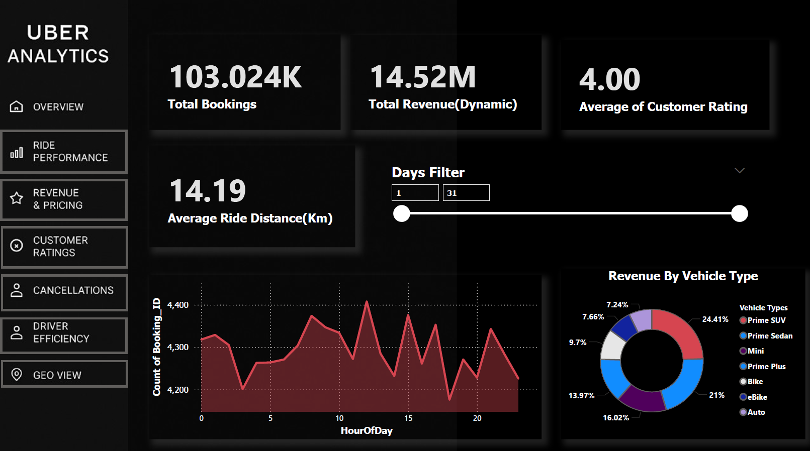
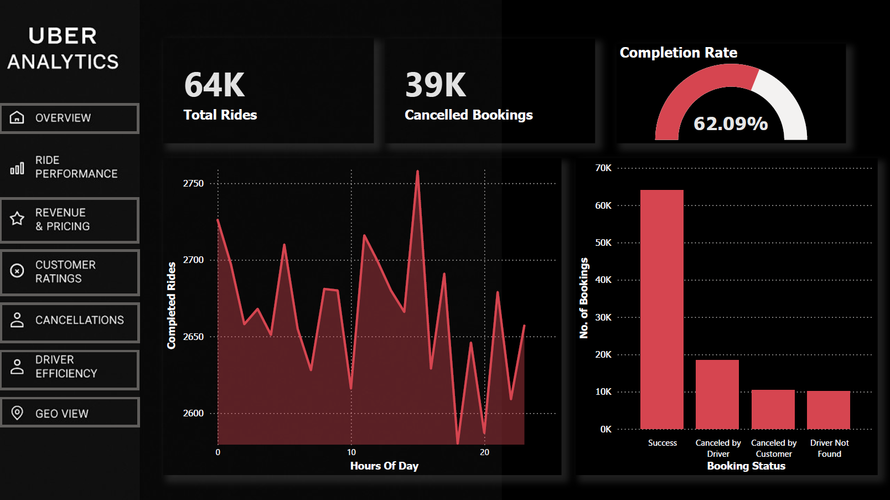
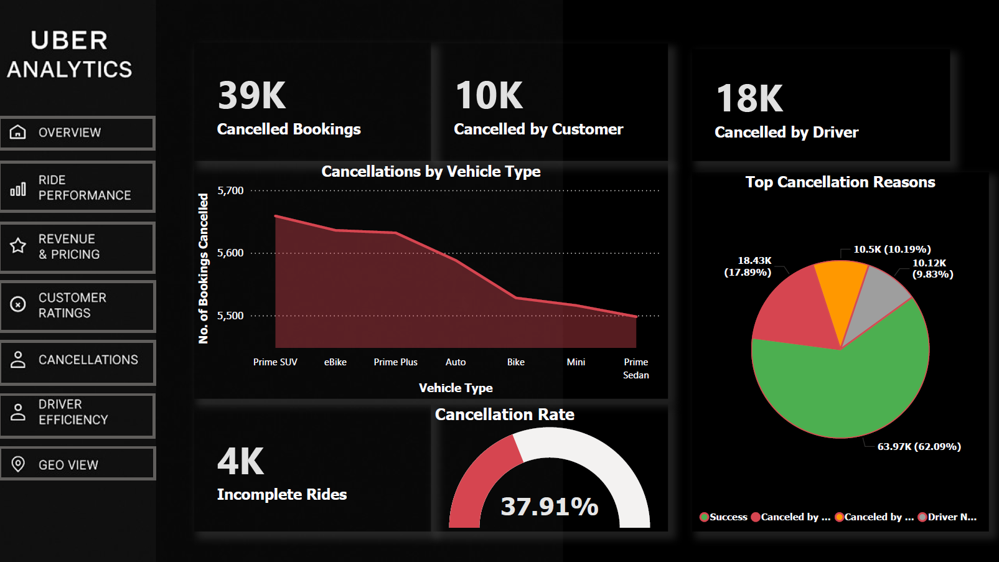

# Uber-Ride-Analytics-PowerBI
Ride Analytics &amp; Operations Dashboard | Power BI | Delhi NCR | 100K Dataset | Interactive BI project

<h1 align="center">🚖 Ride Analytics & Operations Dashboard</h1>
<h3 align="center">Power BI • DAX • ArcGIS / Maps • Data Modeling • Delhi NCR (100K records)</h3>

  
  &nbsp;
  
  &nbsp;
  
  &nbsp;
  

---

## 📌 Quick Summary
A professional, multi-page Power BI dashboard that simulates ride-hailing operations (Uber/Ola style) in **Delhi–Gurugram** for **November 2025**. The project demonstrates end-to-end BI work: **data cleaning**, **modeling**, **DAX measures**, **interactive visuals**, and **geospatial hotspot analysis**.

**Rows:** 100,000 • **Pages:** 7 • **Files:** PBIX, Excel dataset, PDF report

---

## 🎯 Live Preview (Screenshots)
> Add your screenshots into `/images` folder and replace names if needed.

  
  

  
  
  

---

## 🚀 What this project shows
- Clean, consistent dark (Uber-style) UI & navigation  
- 7 pages: Overview, Ride Performance, Revenue & Pricing, Ratings, Cancellations, Driver Performance, Geo Hotspots  
- Advanced DAX measures (CompletionRate, DynamicBookingValue, DriverEfficiency, PeakHourRevenue, etc.)  
- Geospatial analysis with ArcGIS / Map visuals (Top pickup & drop hotspots)  
- KPIs, slicers, tooltips, top-N filters and polished styling for presentation

---

## 🧾 Repository Structure
Ride-Analytics-PowerBI/
├─ Ride_Analytics_Dashboard.pbix
├─ Styled_Ride_Analytics_Project_Report.pdf
├─ dataset/
│ └─ Delhi_Gurugram_Bookings_Nov2025.xlsx
├─ images/
│ ├─ overview.png
│ ├─ revenue.png
│ ├─ ride_performance.png
│ ├─ cancellations.png
│ └─ geo_map.png
└─ README.md
